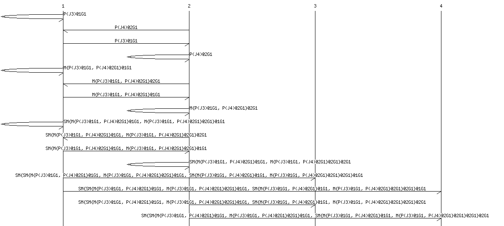

# brb_membership

[MaidSafe website](http://maidsafe.net) | [Safe Network Forum](https://safenetforum.org/)
:-------------------------------------: | :---------------------------------------------:

## About

This BRB Dynamic Membership module enables nodes to dynamically join and leave a BRB voting group.

Please see the [brb crate](https://github.com/maidsafe/brb/).

## Tests

### Message Sequence Charts (MSC)

You will notice that after running `cargo test`, A collection of `.msc` files are generated..

These files show the progression of vote's as they are processed by the network. They can be rendered using the [mscgen](http://www.mcternan.me.uk/mscgen/).
For example the `test_round_robin_split_vote` test generates charts demonstrating how the network handles split votes from 1 through to 6 members, to render out a chart for the case where 2 members vote differently run:

```bash
cargo test # generates the *.msc files in the current directory.

mscgen -T png -i round_robin_split_vote_2.msc -o round_robin_split_vote_2.png
```

The rendered chart `round_robin_split_vote_2.png` will look something like the following:



Note that although the lines between network members are perfectly horizontal, this does not mean that the packet was sent at that time, only that this is when the destination member received the vote.

## License

This Safe Network software is dual-licensed under the Modified BSD (<LICENSE-BSD> <https://opensource.org/licenses/BSD-3-Clause>) or the MIT license (<LICENSE-MIT> <https://opensource.org/licenses/MIT>) at your option.

## Contributing

Want to contribute? Great :tada:

There are many ways to give back to the project, whether it be writing new code, fixing bugs, or just reporting errors. All forms of contributions are encouraged!

For instructions on how to contribute, see our [Guide to contributing](https://github.com/maidsafe/QA/blob/master/CONTRIBUTING.md).
